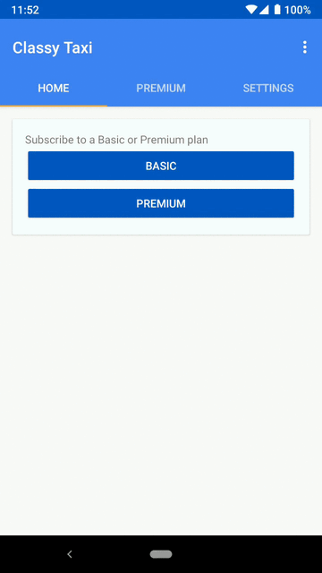

Classy Taxi: Google Play Billing Subscriptions Android App Kotlin Sample
=====================================================

This is the ClassyTaxi Kotlin Android app to buy subscriptions.

Classy Taxi is an end-to-end project that highlights subscription features on Google Play Billing,
such as Real-time Developer Notifications, account hold, grace period, and more. The code has 3
major components: an **Android app** to buy subscriptions, a **[Node.js server](https://github.com/android/play-billing-samples/tree/master/ClassyTaxiServer)**
to manage subscriptions, and a read-only **[web client](https://github.com/android/play-billing-samples/tree/master/ClassyTaxiAppWeb)**
to access the subscriptions on multiple platforms.

# Clone the sample project

    git clone https://github.com/android/play-billing-samples.git

# What do I need?

* A [Google Play Developer Account](https://developer.android.com/distribute/console/) to publish
the app and manage subscriptions

* A [Firebase project](https://firebase.google.com/) to deploy the server implementation on
[Cloud Functions for Firebase](https://firebase.google.com/docs/functions/), enable sign-in, and
support Firebase Cloud Messaging

    * Note: The Firebase project has a corresponding Google Cloud Console project that will be
    configured for Real-time Developer Notifications

* A [Google Cloud Console project](https://developers.google.com/android-publisher/getting_started#linking_your_api_project)
to use the Google Play APIs

    * Note: This is usually a different Google Cloud Console project than the one used with Firebase

# Summary: What order should I do things?

1. Choose the **Android package name**

1. Start the **Firebase Project Setup**

    * Firebase setup requires that you know the Android package name

    * You can add the SHA1 signature information to the Firebase console later

1. Complete the **Android App Setup**

    * The Android app will not build without `google-services.json` from Firebase

1. **Upload a release-build APK** signed with release keys to Google Play

    * To use Google Play Billing APIs you need an APK to published to a track on Google Play
    (internal test, alpha, beta, or production track)

        * [https://support.google.com/googleplay/android-developer/answer/3131213](https://support.google.com/googleplay/android-developer/answer/3131213)

1. Complete the **Firebase Project Setup**

    * If you skipped the Firebase configuration step for the SHA1 fingerprint, you can complete that
     step now by rebuilding with the updated `google-services.json`

1. Start the **Play Developer Console Setup**

    * Google Play Billing APIs require the SKUs to be configured in the console

1. Optional: Test with a debug APK and debug signatures on your device

    * Add your test Google account to the License Testing section of your Google Play Developer
    Account

        * [https://developer.android.com/google/play/billing/billing_testing#testing-purchases](https://developer.android.com/google/play/billing/billing_testing#testing-purchases)

        * [https://developer.android.com/google/play/billing/billing_testing#testing-subscriptions](https://developer.android.com/google/play/billing/billing_testing#testing-subscriptions)

    * **License Testing accounts can use the Google Play Billing APIs with debug builds and debug
    signatures as long as the package name matches the APK in the Play Store**

    * If the Google account is not enabled for License Testing, Google Play Billing APIs will only
    work if the app is installed by Google Play

        * **Sideloaded APKs will not work for users that are not enabled for License Testing**

1. Complete the **Play Developer Console Setup**

    * Link your Google Cloud Console project to the Google Play Developer Account

        * Note: A Google Play Console account can only be linked to a single Google Cloud Console
        project, so **we recommend creating a dedicated Google Cloud Console project that is shared
        by all apps in your Google Play Console**

        * Configure a service account in Google Cloud Console

1. Complete **Real-time Developer Notifications Setup**

11. **Deploy [Backend Server](https://github.com/android/play-billing-samples/tree/master/ClassyTaxiServer)**

# Firebase Project Setup

This sample application uses Firebase (Auth, Notifications, Firestore).

1. Go to **Firebase Console** and create a Firebase project

    * [https://console.firebase.google.com/](https://console.firebase.google.com/)

1. In the project, go to Develop > Database > Cloud Firestore > Get started > Start in locked mode

    * Wait for Firestore to be enabled for the project

1. In the project, go to Develop > Authentication > Sign-in Method. Enable Email/Password and Google
 as sign-in providers

1. Add your Android app to the project

    * [https://firebase.google.com/docs/android/setup#manually_add_firebase](https://firebase.google.com/docs/android/setup#manually_add_firebase)

1. Add your app's SHA1 fingerprint for Google Sign-In

    * [https://firebase.google.com/docs/auth/android/firebaseui#before_you_begin](https://firebase.google.com/docs/auth/android/firebaseui#before_you_begin)

    * Specify your app's SHA-1 fingerprint from the [Settings page](https://console.firebase.google.com/project/_/settings/general/)
    of the Firebase console

    * See [Authenticating Your Client](https://developers.google.com/android/guides/client-auth)
    for details on how to get your app's SHA-1 fingerprint

    * If you do not know your SHA1 fingerprint yet, please skip it for now and return after you have
     signed your APK later

1. Download the generated `google-services.json` and move it to your app module directory

    * `{project_folder}/app/google-services.json`

# Android App Setup

In order to use the Google Play Billing APIs, you must pick a unique package name and upload a
[signed release APK](https://developer.android.com/studio/publish/app-signing.html) to Google Play.
The Android app will only build after you include a compatible `google-services.json` file from the
Firebase configuration.

## Build your APK from Android Studio

1. Open Android Studio, select File > Open and pick the root build.gradle file

    * `{project_folder}/build.gradle`

1. Change the `androidApplicationId` to the correct Android package name

    * `{project_folder}/gradle.properties`

1. Confirm that you have the latest `google-services.json` from the Firebase configuration in your
app directory

    * `{project_folder}/app/google-services.json`

1. Optional: If you want to test the UI without the Firebase server, change this variable in
`Constants.kt`

    * `USE_FAKE_SERVER = true`

1. Rebuild the Gradle project verify that there are no errors

1. Sign a release build with your release key

    * [https://developer.android.com/studio/publish/app-signing#sign-apk](https://developer.android.com/studio/publish/app-signing#sign-apk)

1. If you skipped the Firebase configuration step for the SHA1 fingerprint, you can complete that
step now, and rebuild with the updated `google-services.json`

# Play Developer Console Setup

1. Create an application in the Google Play Developer Console

    * [https://play.google.com/apps/publish](https://play.google.com/apps/publish)

1. Upload and publish the release APK to the Internal Test, Alpha, Beta, or Production channel

    * [https://support.google.com/googleplay/android-developer/answer/113469](https://support.google.com/googleplay/android-developer/answer/113469)

1. Create subscription products for a Basic Subscription and Premium Subscription

    * [https://support.google.com/googleplay/android-developer/answer/140504](https://support.google.com/googleplay/android-developer/answer/140504)

    * If you use different values than the defaults in the Android app `Constants.kt`, update the
    Android app with the matching values

    * Write down your product IDs (SKUs) so you can configure your backend server

1. Link the Google Cloud Console project to the Google Play Developer Account

    * [https://developers.google.com/android-publisher/getting_started#linking_your_api_project](https://developers.google.com/android-publisher/getting_started#linking_your_api_project)

    * Use the Google Cloud Console project that corresponds to your Google Play Developer Account

    * Enable API access using a service account

        * [https://developers.google.com/android-publisher/getting_started#using_a_service_account](https://developers.google.com/android-publisher/getting_started#using_a_service_account)

    * Create a new private key for your service account, and download it in JSON format with the
    filename `service-account.json`

    * Copy `service-account.json` to

        *  `{project_folder}/ClassyTaxiServer/src/service-account.json`

1. Optional: Create a license test account to [test subscriptions quickly](https://android-developers.googleblog.com/2018/01/faster-renewals-for-test-subscriptions.html) without spending money

    * [https://developer.android.com/google/play/billing/billing_testing.html#test-purchases-sandbox](https://developer.android.com/google/play/billing/billing_testing.html#test-purchases-sandbox)

# Real-time Developer Notifications Setup

1. Use the Google Cloud Console project that corresponds to the Firebase project to enable Cloud
PubSub

    * [https://developer.android.com/google/play/billing/realtime_developer_notifications#initial_cloud_pubsub_setup](https://developer.android.com/google/play/billing/realtime_developer_notifications#initial_cloud_pubsub_setup)

    * Name your PubSub topic: `play-subs`

    * Add the Google Play service account to the topic

        * `google-play-developer-notifications@system.gserviceaccount.com`

    * Grant the Role **Pub/Sub Publisher** to the Google Play service account

        * Note: Make sure to set the role as **Publisher** so that Google Play can publish updates
        to your project

1. Configure the Google Play Console to allow your backend to receive notifications from Play Store
 for subscription purchase changes

    * [https://developer.android.com/google/play/billing/realtime_developer_notifications#updating_the_google_play_console](https://developer.android.com/google/play/billing/realtime_developer_notifications#updating_the_google_play_console)

    * Your real-time developer notifications topic should be in this format

        *  `projects/{your_firebase_project_id}/topics/play-subs`

# Deploy Backend Server

These are steps to build the backend server code located [here](https://github.com/android/play-billing-samples/tree/master/ClassyTaxiServer)

1. Make sure you have installed Node.js, npm, and Firebase CLI

    * [https://firebase.google.com/docs/cli/](https://firebase.google.com/docs/cli/)

1. Run `npm install` to install dependencies

1. Configure Cloud Functions for Firebase with your Android app and subscription products

        firebase use --add {your_firebase_project_id}

        firebase functions:config:set app.package_name="your_android_application_id"

        firebase functions:config:set app.basic_plan_sku="your_basic_subscription_product_sku_id"

        firebase functions:config:set app.premium_plan_sku="your_premium_subscription_product_sku_id"

1. Run `firebase deploy` to deploy your backend to Cloud Functions for Firebase

# Troubleshoot common issues

* Q: There is a warning "*Billing account not configured. External network is not accessible and
quotas are severely limited. Configure billing account to remove these restrictions*" in my Cloud
Functions log.

  * A: You can safely ignore the warning and stay use the Firebase Spark Plan because the sample
  only accesses the Google network.

* Q: Android build: `Execution failed for task :app:processDebugGoogleServices. File
google-services.json is missing. The Google Services Plugin cannot function without it`.

    * A: Download `google-services.json` from the Firebase console.

* Q: Android build: `No matching client found for package name com.example.subscriptions.classytaxi'`.

    * A: Change the `androidApplicationId` in `gradle.properties` and download the updated
    `google-services.json` from your Firebase project configuration.

* Q: Real-time Developer Notifications are not working.

    * A: Make sure the Google Play service account has access as the **Publisher** so Google Play
    can publish updates to you.

# Optional: Build the Android app from the command line

The sample allows you to specify signing keys and a package name with the Gradle command line. This
allows you to build and sign a release APK without making any modifications to the git repository.
The sample contains a file `example-keystore.properties` that you can copy (or modify) to meet your
needs.

1. Create a file `release-keystore.properties` with your release key information (see
`example-keystore.properties` for the expected format)

    * [https://developer.android.com/studio/publish/app-signing.html#signing-manually](https://developer.android.com/studio/publish/app-signing.html#signing-manually)

1. Download the generated `google-services.json` and move it to your app module directory

    * `{project_folder}/app/google-services.json`

1. Run the following Gradle command in the directory `{project_folder}`

    * Replace the Android application ID with your unique package name

          ./gradlew -PandroidApplicationId=com.example.subscriptions.different.package PkeystorePropertiesFilename=release-keystore.properties assembleRelease

1. Find the location of the output APK

       {project_folder}/app/build/outputs/apk/release/app-release.apk

1. Deploy this APK to your Internal Test track for fast development

    * [https://support.google.com/googleplay/android-developer/answer/3131213](https://support.google.com/googleplay/android-developer/answer/3131213)

## Android files required for a release APK with release keys

* Keystore: `release.jks`
* Passwords: `release-keystore.properties`
* Firebase configuration: `google-services.json`

## Full list of commands to build a release APK

    cd {project_folder}

    ### Put release keystore information in the root project directory
    cp /path/to/your/secrets/release.jks .
    cp /path/to/your/secrets/release-keystore.properties .

    ### Put Firebase google-services.json in the `app/` directory
    cp /path/to/your/secrets/google-services.json ./app/google-services.json

    ### Check to make sure the files are in the correct location
    ls -1 *.jks *keystore.properties
    # debug.jks
    # keystore.properties
    # release-keystore.properties
    # release.jks

    ### Make sure you are not tracking any secret files in git
    git status
    # On branch master
    # nothing to commit, **working tree clean**

    ### Release build with release keys
    ./gradlew -PkeystorePropertiesFilename=release-keystore.properties -PandroidApplicationId=com.example.subscriptions.different.package assembleRelease

    ### Debug build with release keys
    ./gradlew -PkeystorePropertiesFilename=release-keystore.properties -PandroidApplicationId=com.example.subscriptions.different.package assembleDebug

    ### Specify version name and version code
    ./gradlew -PandroidMobileVersionName=1.0.1 -PandroidMobileVersionCode=2 -PkeystorePropertiesFilename=release-keystore.properties -PandroidApplicationId=com.example.subscriptions.different.package assembleRelease

    ### Note: Release builds must be installed by Google Play.
    ### This means you must deploy release builds to a
    ### track on Google Play in order to use the Google Play Billing APIs.
    ### Use debug builds to sideload the app for testing.
    ### Android Studio creates debug builds by default.
    ### Gradle will create debug builds with the task `assembleDebug`.

